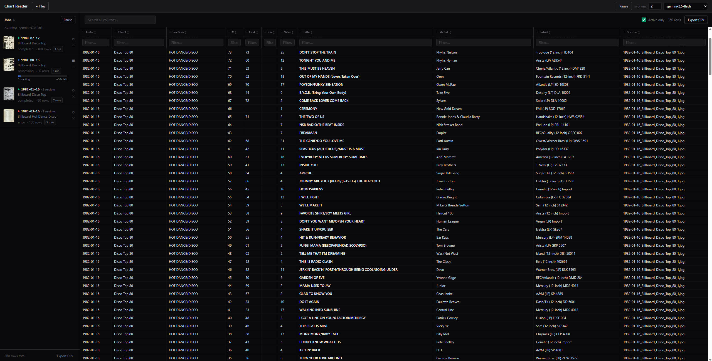

# Chart Reader

Digitize scanned Billboard-style chart images into an append-only CSV using Gemini.

## Quick start (Docker)

1. Set the environment variable `GOOGLE_GENERATIVE_AI_API_KEY`.
2. Run:
   - `docker compose up --build`
3. Open `http://localhost:3000`

Files are stored in the mounted `./files` folder:
- `files/new` (incoming uploads)
- `files/completed` (processed)
- `files/state/app.db` (SQLite)
- `files/output.csv` (export)

## Example

1. Start the app (`docker compose up --build`) and open `http://localhost:3000`.
2. Click `+ Files` and upload a chart image (PNG/JPEG/WebP).
   - Tip: include the chart date in the filename (e.g. `1986-04-12_top100.png`) so `entry_date` is set correctly.
3. When processing finishes, click **Export CSV** (or download from `http://localhost:3000/api/csv`).



Example CSV rows:

```csv
entry_date,chart_title,chart_section,this_week_rank,last_week_rank,two_weeks_ago_rank,weeks_on_chart,title,artist,label,source_file,run_id,extracted_at
2026-02-01,Top 100,Main,1,2,3,5,New Song,New Artist,New Label,job-1.png,run-new,2026-02-01T00:03:00.000Z
2026-02-08,Top 100,Main,7,8,9,2,Other Song,Other Artist,Other Label,job-2.png,run-2,2026-02-08T00:03:00.000Z
```

## Local dev (Node)

- `npm install`
- `npm run dev`
  - Web: `http://localhost:5173`
  - API: `http://localhost:3000`

Production-style local run:
- `npm run build`
- `npm start` (serves the built web UI + API from `http://localhost:3000`)

## Filename date rule

The backend reads the chart date from the first `YYYY-MM-DD` found anywhere in the filename (e.g. `1986-04-12_top100.jpg`).
